# AI Kubernetes Operations Platform

Production-style cloud, DevOps, and platform engineering project for AI-assisted Kubernetes troubleshooting.

The platform combines a Streamlit operations UI, a FastAPI backend, PostgreSQL incident history, AWS infrastructure provisioned with Terraform, Kubernetes deployments on Amazon EKS, CI/CD through GitHub Actions, and observability with Prometheus and Grafana.

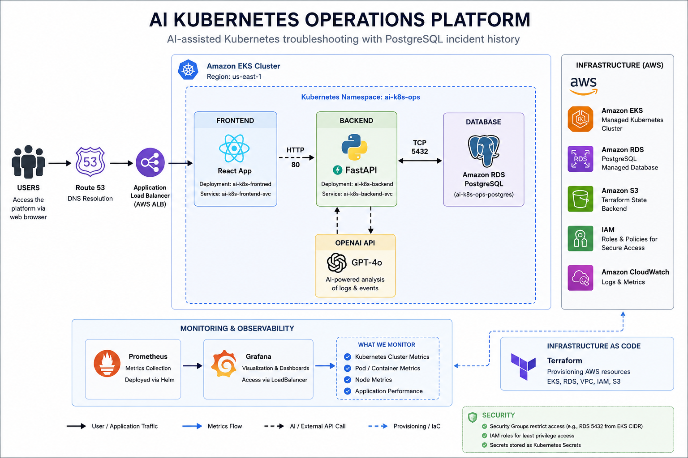

## Project Overview

AI Kubernetes Operations Platform helps operators analyse Kubernetes incidents by combining pod logs, namespace events, and AI-generated remediation guidance. Each analysis is stored in PostgreSQL so incidents can be reviewed later as an operational history.

The project demonstrates an end-to-end platform workflow:

- Infrastructure provisioning with Terraform
- Amazon EKS for Kubernetes workloads
- Amazon RDS PostgreSQL for incident history
- FastAPI backend for troubleshooting APIs
- Streamlit frontend for operator workflows
- OpenAI-powered incident analysis with deterministic fallback analysis
- Kubernetes manifests for application deployment
- HPA autoscaling for backend workloads
- Prometheus and Grafana observability
- Trivy, Terraform, Kubernetes, and monitoring validation in CI/CD
- GHCR image publishing and automated deployment to EKS

## Architecture

```text
Users
  |
  v
Route 53 / Load Balancer
  |
  v
Streamlit Frontend
  |
  v
FastAPI Backend
  |----------------------|
  |                      |
  v                      v
Kubernetes Logs/Events   OpenAI Analysis Engine
  |                      |
  |----------------------|
  |
  v
Amazon RDS PostgreSQL Incident History

Observability:
EKS workloads -> Prometheus -> Grafana dashboards

Infrastructure:
Terraform -> VPC, EKS, RDS, IAM, S3 backend
```

## Repository Structure

```text
.
|-- backend/              # FastAPI API, AI analysis engine, DB models, Kubernetes client
|-- frontend/             # Streamlit operator interface
|-- k8s/                  # Kubernetes namespace, deployments, services, HPA, ingress/config
|-- terraform/            # AWS VPC, EKS, RDS modules and dev environment
|-- monitoring/           # kube-prometheus-stack install script and Grafana dashboard
|-- security/             # Trivy scanning helper
|-- scripts/              # Kubernetes secret generation helper
|-- gitops/               # Argo CD application manifest
|-- .github/workflows/    # CI/CD pipeline
`-- docs/images/          # Project screenshots and architecture visuals
```

## Application Components

| Component | Technology | Purpose |
| --- | --- | --- |
| Frontend | Streamlit | Operator UI for submitting logs/events, running analysis, viewing history, and fetching pods |
| Backend | FastAPI | REST API for health checks, pod discovery, incident analysis, and history retrieval |
| AI engine | OpenAI API | Produces structured incident summaries, causes, actions, and severity |
| Fallback analysis | Python logic | Returns useful remediation output when no OpenAI API key is configured |
| Database | PostgreSQL / Amazon RDS | Stores incident analysis history |
| Kubernetes | Amazon EKS | Runs frontend, backend, services, secrets, HPA, and monitoring |
| Observability | Prometheus + Grafana | Collects and visualizes cluster, node, pod, and application metrics |
| CI/CD | GitHub Actions | Validates, scans, builds, provisions, deploys, and verifies the platform |

## API Endpoints

The backend exposes the following FastAPI endpoints:

| Method | Endpoint | Description |
| --- | --- | --- |
| `GET` | `/` | API root status |
| `GET` | `/health` | Health check used by Kubernetes probes |
| `GET` | `/pods/{namespace}` | Lists pods in a Kubernetes namespace |
| `POST` | `/troubleshoot` | Analyses logs/events and stores incident history |
| `GET` | `/history` | Returns the latest incident analysis records |

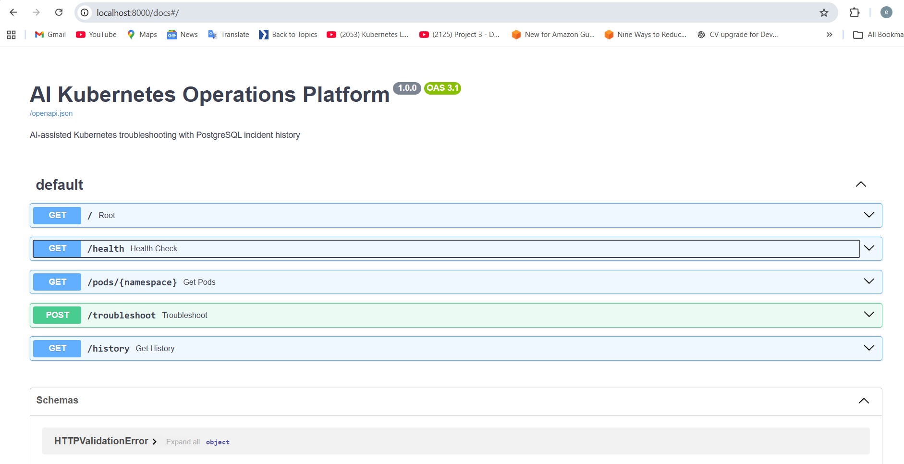

## Frontend Workflow

The Streamlit UI lets an operator:

1. Select a Kubernetes namespace.
2. Optionally specify a pod name.
3. Paste logs and Kubernetes events manually.
4. Run incident analysis.
5. Review severity, likely causes, and recommended actions.
6. Load previous incident history from PostgreSQL.
7. Fetch pods from the selected namespace.

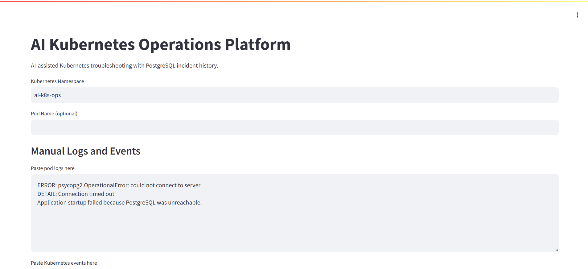

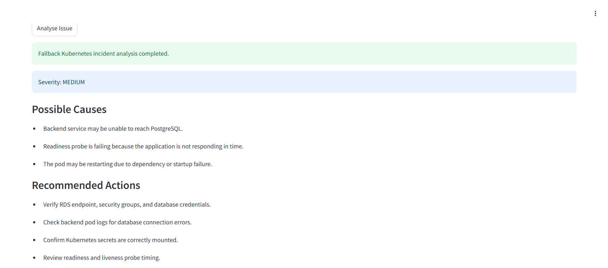

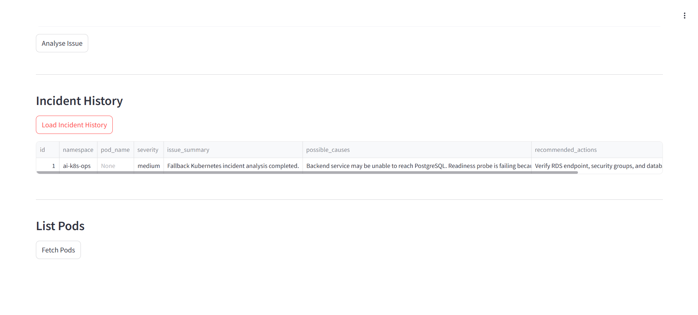

## Infrastructure

Terraform provisions the AWS foundation:

- VPC with public and private subnets
- Internet/NAT routing
- EKS cluster and managed node group
- IAM roles and policy attachments
- RDS PostgreSQL instance
- Security groups for application and database access
- Remote state backend support

The CI/CD workflow sets `AWS_REGION=us-east-1`. The Terraform dev variables also include a default region that can be overridden during deployment.

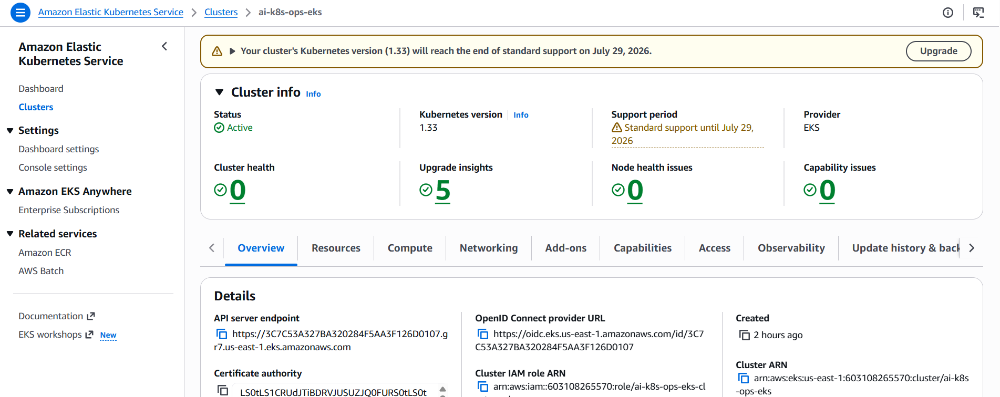

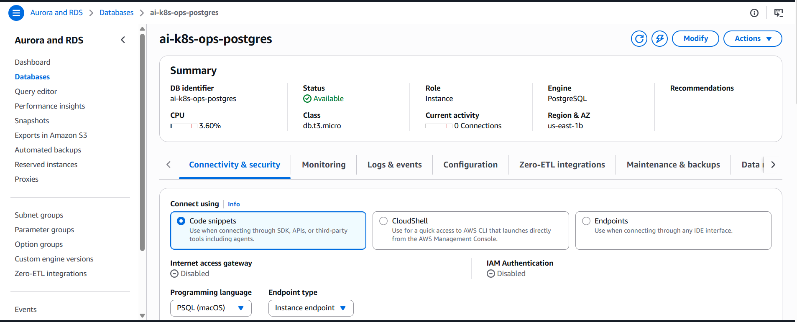

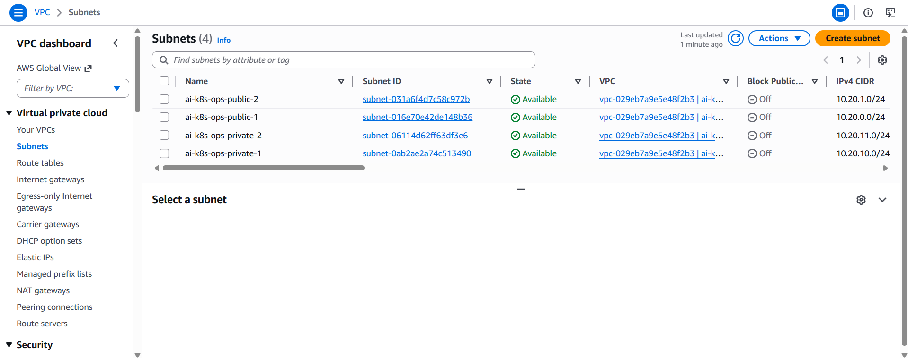

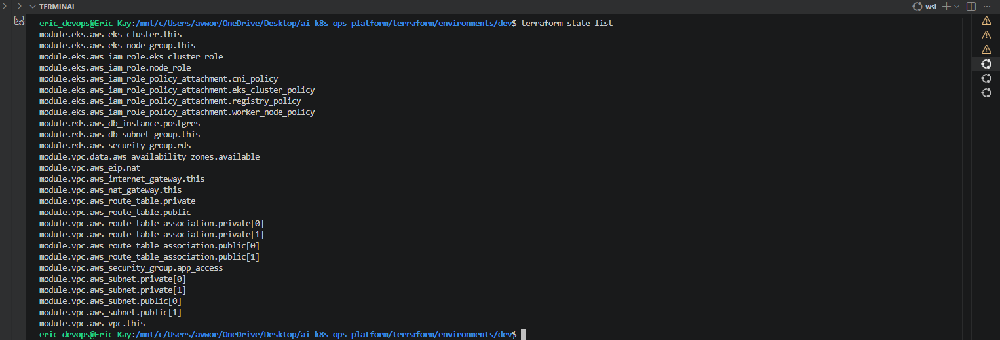

## Kubernetes Deployment

The application runs in the `ai-k8s-ops` namespace.

Workloads:

- `ai-k8s-backend`: 2 replicas, FastAPI on port `8000`
- `ai-k8s-frontend`: 2 replicas, Streamlit on port `8501`
- `ai-k8s-backend` service: `ClusterIP`
- `ai-k8s-frontend` service: `LoadBalancer`
- `ai-k8s-backend-hpa`: CPU-based autoscaling from 2 to 5 replicas

Runtime configuration is provided through:

- `postgres-secret` for database connectivity
- `openai-secret` for AI analysis
- `ghcr-secret` for private GHCR image pulls
- `ai-k8s-config` for frontend backend URL configuration

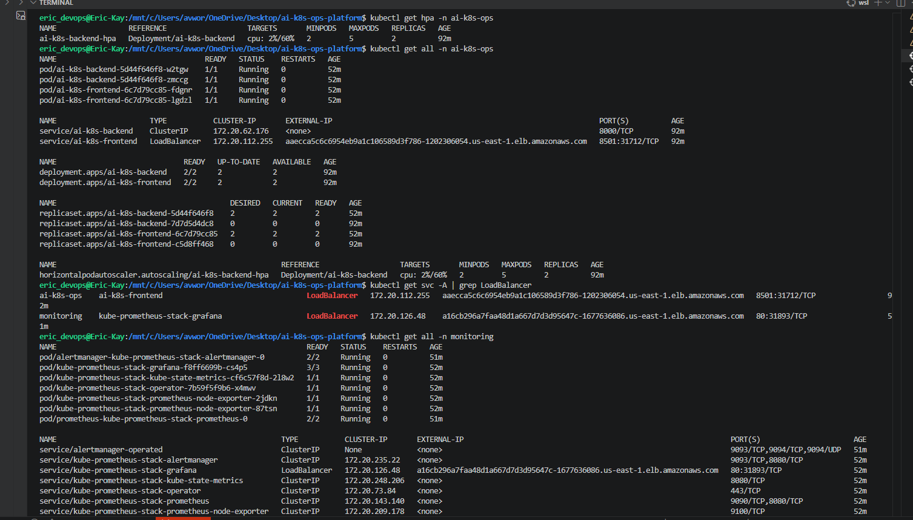

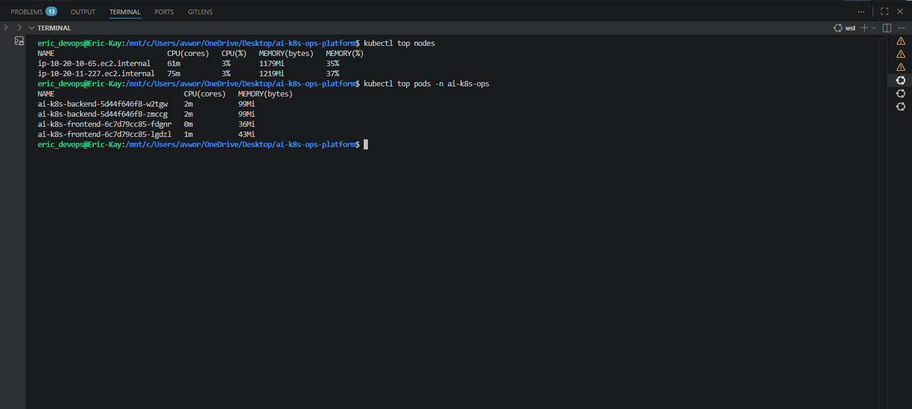

## Observability

Monitoring is installed with `kube-prometheus-stack` through Helm.

The monitoring stack includes:

- Prometheus target discovery and scraping
- Grafana dashboards
- Node exporter metrics
- kube-state-metrics
- Kubernetes API server metrics
- Pod-level CPU and memory visibility

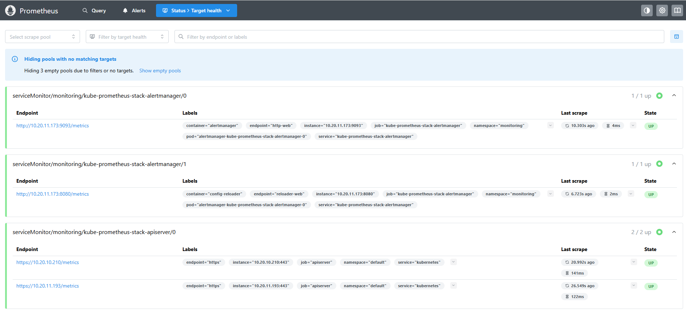

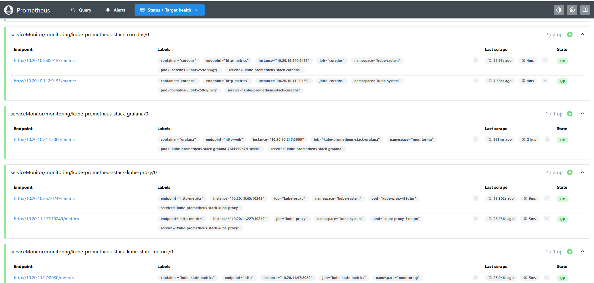

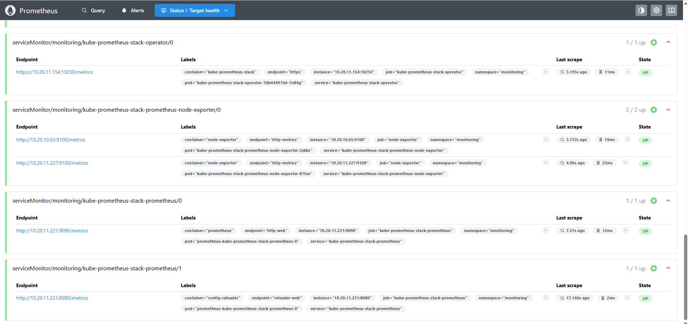

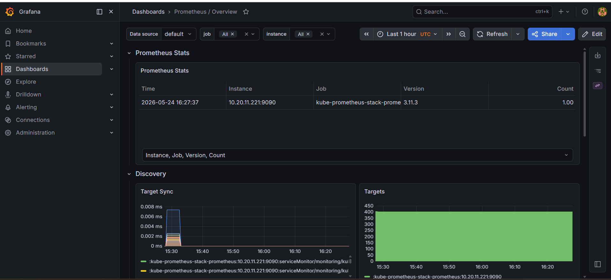

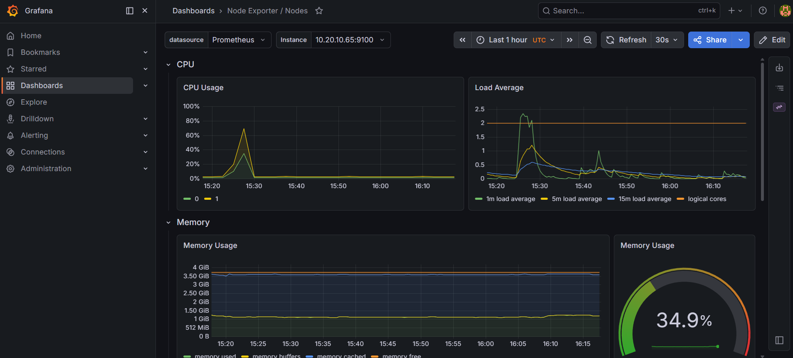

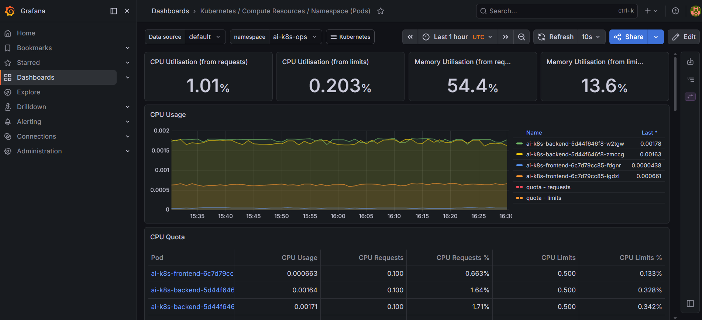

## CI/CD Pipeline

GitHub Actions provides a full platform pipeline:

1. Security scan with Trivy for filesystem, Kubernetes, and Terraform configuration.
2. Terraform format, init, and validate.
3. Kubernetes manifest validation with kubeconform.
4. Monitoring file validation.
5. Backend and frontend Docker image builds.
6. Image push to GitHub Container Registry.
7. Terraform apply for AWS infrastructure.
8. Kubernetes secret creation.
9. Application deployment to EKS.
10. Monitoring stack installation.
11. Final cluster, application, HPA, and monitoring validation.

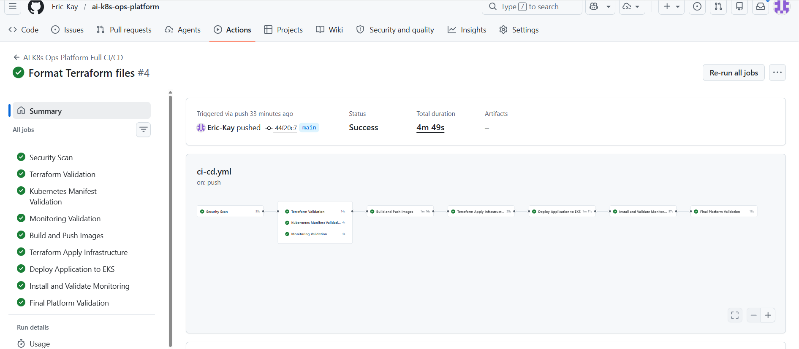

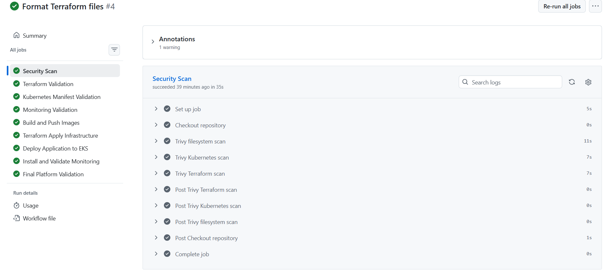

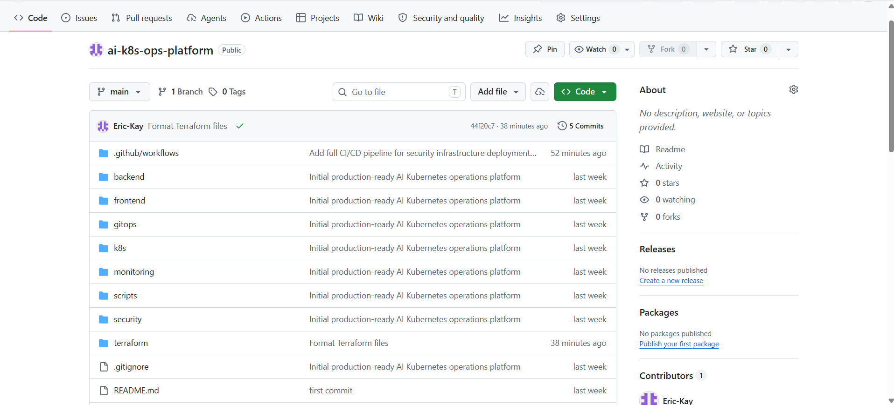

## Local Development

### Prerequisites

- Docker and Docker Compose
- Python 3.11+
- kubectl
- Terraform 1.5+
- AWS CLI
- Helm
- OpenAI API key, optional for local fallback mode

### Run Locally With Docker Compose

```bash
docker compose up --build
```

Local services:

| Service | URL |
| --- | --- |
| Frontend | `http://localhost:8501` |
| Backend API | `http://localhost:8000` |
| FastAPI docs | `http://localhost:8000/docs` |
| PostgreSQL | `localhost:5432` |

### Run Backend Locally

```bash
cd backend
pip install -r requirements.txt
uvicorn app.main:app --reload --host 0.0.0.0 --port 8000
```

### Run Frontend Locally

```bash
cd frontend
pip install -r requirements.txt
BACKEND_URL=http://localhost:8000 streamlit run app.py
```

On PowerShell:

```powershell
$env:BACKEND_URL="http://localhost:8000"
streamlit run app.py
```

## Deployment

### Provision Infrastructure

```bash
cd terraform/environments/dev
terraform init
terraform apply \
  -var="db_password=<secure-password>" \
  -var="aws_region=us-east-1"
```

### Configure kubeconfig

```bash
aws eks update-kubeconfig \
  --name ai-k8s-ops-eks \
  --region us-east-1
```

### Create Kubernetes Secrets

```bash
kubectl create namespace ai-k8s-ops --dry-run=client -o yaml | kubectl apply -f -

kubectl create secret generic postgres-secret \
  --namespace ai-k8s-ops \
  --from-literal=POSTGRES_HOST="<rds-endpoint>" \
  --from-literal=POSTGRES_PORT="5432" \
  --from-literal=POSTGRES_DB="aik8sops" \
  --from-literal=POSTGRES_USER="aik8sadmin" \
  --from-literal=POSTGRES_PASSWORD="<secure-password>"

kubectl create secret generic openai-secret \
  --namespace ai-k8s-ops \
  --from-literal=OPENAI_API_KEY="<openai-api-key>"
```

### Deploy Application

```bash
kubectl apply -f k8s/
kubectl rollout status deployment ai-k8s-backend -n ai-k8s-ops
kubectl rollout status deployment ai-k8s-frontend -n ai-k8s-ops
```

### Install Monitoring

```bash
chmod +x monitoring/install-monitoring.sh
bash monitoring/install-monitoring.sh
```

## Useful Commands

```bash
kubectl get all -n ai-k8s-ops
kubectl get hpa -n ai-k8s-ops
kubectl get svc -A | grep LoadBalancer
kubectl top nodes
kubectl top pods -n ai-k8s-ops
kubectl logs deployment/ai-k8s-backend -n ai-k8s-ops
kubectl logs deployment/ai-k8s-frontend -n ai-k8s-ops
```

## Environment Variables

### Backend

| Variable | Description |
| --- | --- |
| `POSTGRES_HOST` | PostgreSQL host or RDS endpoint |
| `POSTGRES_PORT` | PostgreSQL port, usually `5432` |
| `POSTGRES_DB` | Database name |
| `POSTGRES_USER` | Database username |
| `POSTGRES_PASSWORD` | Database password |
| `OPENAI_API_KEY` | OpenAI API key for AI troubleshooting |
| `OPENAI_MODEL` | Model used by the backend, defaults to `gpt-4o-mini` |

### Frontend

| Variable | Description |
| --- | --- |
| `BACKEND_URL` | URL of the FastAPI backend |

## Security Notes

- Database credentials are injected through Kubernetes Secrets.
- OpenAI credentials are injected through Kubernetes Secrets.
- GHCR access is managed through a Kubernetes image pull secret.
- RDS access is restricted through security groups.
- Trivy scans filesystem, Kubernetes manifests, and Terraform configuration.
- CI/CD uses GitHub Actions secrets for AWS, database, OpenAI, and GHCR credentials.

## Screenshots

| Area | Screenshot |
| --- | --- |
| Architecture |  |
| Frontend | 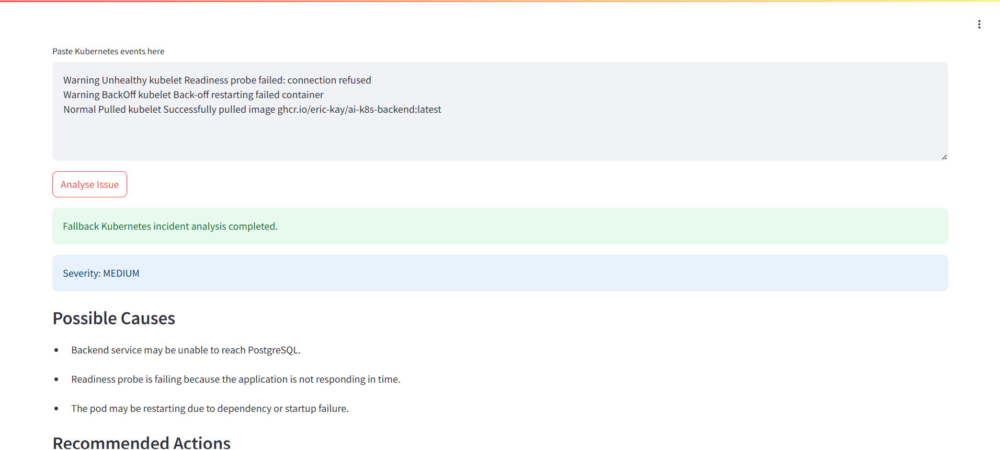 |
| API docs |  |
| EKS |  |
| RDS |  |
| CI/CD |  |
| Prometheus |  |
| Grafana |  |

## Status

The screenshots show the platform running with:

- Active EKS cluster
- Running frontend and backend replicas
- LoadBalancer access for the frontend and Grafana
- Healthy Prometheus targets
- Grafana dashboards for cluster, node, and pod metrics
- RDS PostgreSQL available
- Successful CI/CD pipeline execution
- Terraform-managed AWS resources
